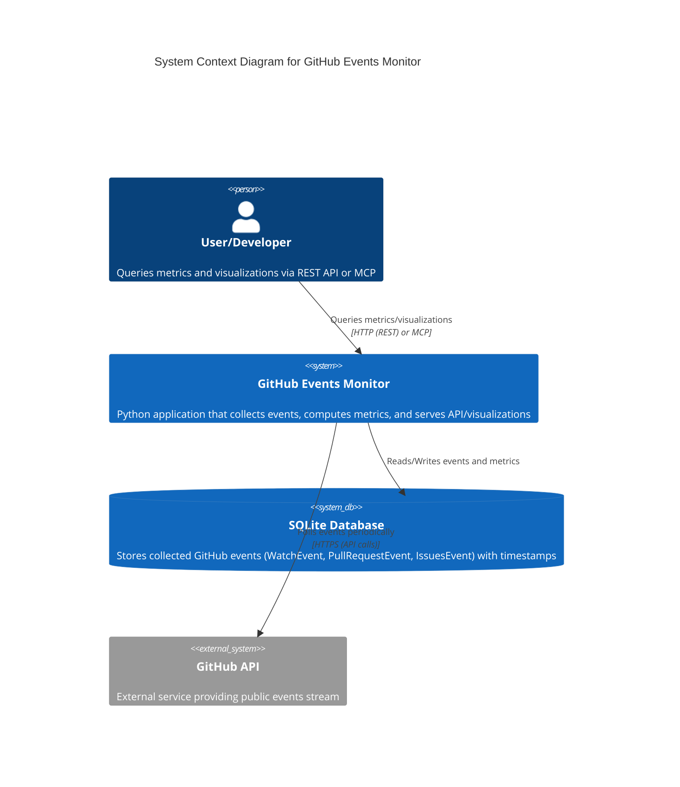

# C4 Model - Level 1: System Context Diagram

This diagram provides a high-level overview of the GitHub Events Monitor system, following the C4 model (https://c4model.com/). It shows the system in context with users and external dependencies.

## Mermaid Diagram

### Explanation
- **User/Developer**: Interacts with the system to get insights on GitHub activity.
- **GitHub Events Monitor**: Core application handling event collection, storage, and API serving.
- **SQLite Database**: Persistent storage for events.
- **GitHub API**: Source of raw event data.

This is a Level 1 (System Context) diagram, focusing on the system as a black box and its interactions.
