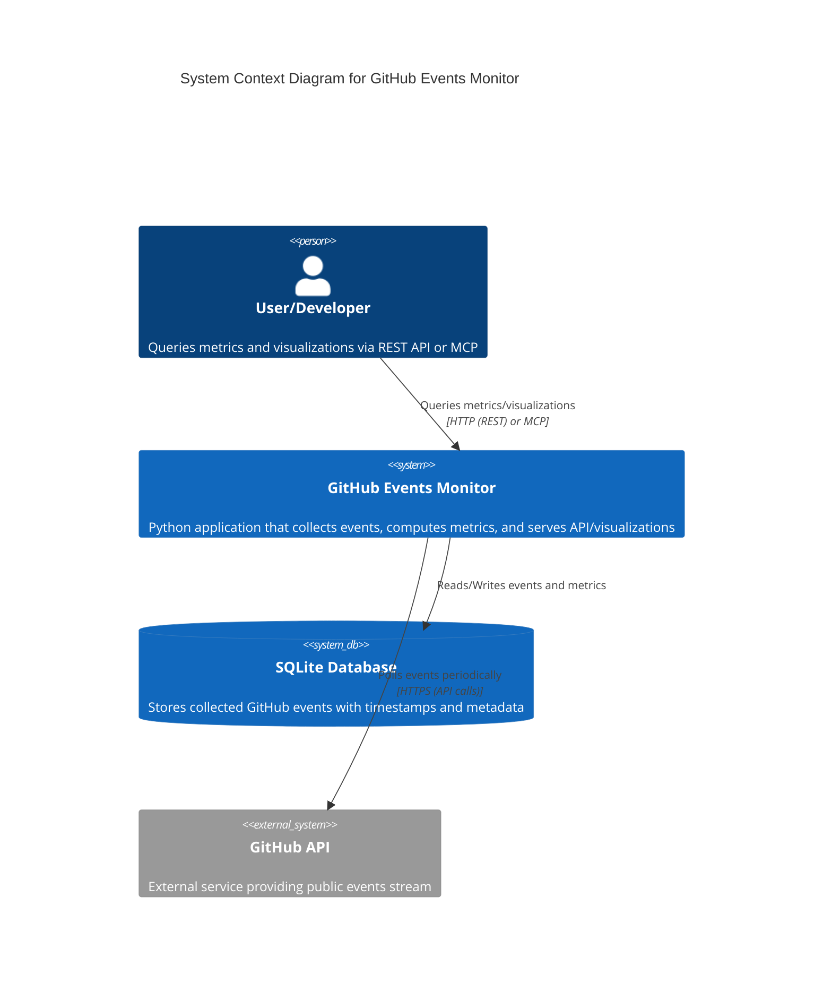

# Architecture Documentation

## System Architecture Overview

The GitHub Events Monitor follows a clean, modular architecture designed for reliability, scalability, and maintainability.

## C4 Model Level 1: System Context Diagram



## Core Components

### 1. Background Collector (`collector.py`)
**Purpose**: Continuously polls GitHub Events API and stores filtered events.

**Key Features**:
- Asynchronous polling every 5 minutes (configurable)
- Proper rate limiting with GitHub API headers
- ETag-based caching to reduce API calls
- Event filtering (WatchEvent, PullRequestEvent, IssuesEvent)
- Deduplication based on event IDs
- SQLite storage with optimized indices

**Technology**: Async Python, HTTPX, SQLite

### 2. REST API Server (`api.py`)
**Purpose**: Provides HTTP endpoints for metrics and visualizations.

**Key Endpoints**:
- `/metrics/event-counts` - Event counts by type with time offset
- `/metrics/pr-interval` - Average time between pull requests
- `/metrics/repository-activity` - Repository activity summary
- `/metrics/trending` - Trending repositories
- `/visualization/trending-chart` - Chart generation
- `/health` - Health check and system status

**Technology**: FastAPI, Uvicorn, Pydantic

### 3. MCP Server (`mcp_server.py`)
**Purpose**: Model Context Protocol integration for AI tools.

**Features**:
- Tools for metric retrieval and analysis
- Resources for event data access
- Prompts for AI-assisted analysis
- Compatible with Claude Desktop, Cursor, and other MCP clients

**Technology**: MCP framework, async Python

### 4. Configuration Management (`config.py`)
**Purpose**: Centralized configuration and environment management.

**Features**:
- Environment variable loading
- Default value management
- Validation and type conversion
- Database path resolution
- GitHub token handling

### 5. Database Layer (SQLite)
**Purpose**: Persistent storage for collected events and computed metrics.

**Schema**:
```sql
CREATE TABLE events (
    id TEXT PRIMARY KEY,
    type TEXT NOT NULL,
    repo_name TEXT,
    created_at TEXT NOT NULL,
    actor_login TEXT,
    payload TEXT
);

CREATE INDEX idx_events_type_created ON events(type, created_at);
CREATE INDEX idx_events_repo_created ON events(repo_name, created_at);
CREATE INDEX idx_events_created ON events(created_at);
```

## Data Flow Architecture

```
┌─────────────────┐    ┌─────────────────┐    ┌─────────────────┐
│   GitHub API    │    │  Background     │    │   SQLite DB     │
│   /events       │───▶│   Collector     │───▶│   Events        │
│                 │    │                 │    │   Storage       │
└─────────────────┘    └─────────────────┘    └─────────────────┘
                                                       │
                                                       ▼
┌─────────────────┐    ┌─────────────────┐    ┌─────────────────┐
│   End Users     │    │   REST API      │    │   Metrics       │
│   (HTTP/MCP)    │◀───│   FastAPI       │◀───│   Engine        │
│                 │    │                 │    │                 │
└─────────────────┘    └─────────────────┘    └─────────────────┘
```

### Step-by-Step Data Flow

1. **Event Collection**: 
   - Background collector polls GitHub API every 5 minutes
   - Filters for WatchEvent, PullRequestEvent, IssuesEvent
   - Handles rate limiting and ETag caching

2. **Storage**:
   - Events stored in SQLite with deduplication
   - Optimized indices for time-based queries
   - Automatic cleanup of old events (configurable retention)

3. **Metrics Calculation**:
   - Real-time calculation from stored data
   - Time-based filtering with configurable offsets
   - Repository-specific aggregations

4. **API Response**:
   - REST endpoints serve calculated metrics
   - MCP tools provide AI-friendly interfaces
   - Chart generation for visualizations

## Design Decisions

### 1. SQLite vs PostgreSQL
**Decision**: Use SQLite as primary storage
**Rationale**: 
- Zero-configuration deployment
- Sufficient for typical event volumes
- Easy migration path to PostgreSQL when needed
- Embedded database reduces infrastructure complexity

### 2. Async Architecture
**Decision**: Full async implementation
**Rationale**:
- Non-blocking I/O for API polling
- Better performance under load
- Scalable design for multiple concurrent users
- Modern Python best practices

### 3. Dual Interface (REST + MCP)
**Decision**: Provide both REST API and MCP server
**Rationale**:
- REST API for traditional integrations
- MCP server for AI tool compatibility
- Flexibility for different use cases
- Future-proofing for AI-driven workflows

### 4. Background Polling vs Webhooks
**Decision**: Use polling approach
**Rationale**:
- GitHub Events API doesn't support webhooks for public events
- Polling is more reliable and predictable
- Rate limiting can be properly managed
- No infrastructure requirements for webhook handling

### 5. Time-Based Partitioning
**Decision**: Use time-based indices and queries
**Rationale**:
- Most queries are time-range based
- Efficient for offset-based metrics
- Natural data lifecycle management
- Optimal for typical usage patterns

## Scalability Considerations

### Horizontal Scaling
- Multiple instances can share the same database
- Read replicas for query-heavy workloads
- Load balancer for API endpoints
- Separate collector and API processes

### Vertical Scaling
- Database optimization with proper indices
- Connection pooling for high concurrency
- Memory-based caching for frequent queries
- Async processing for I/O operations

### Database Migration Path
- Easy migration to PostgreSQL for high volume
- Schema compatibility maintained
- Migration scripts provided
- No application code changes required

## Security Architecture

### API Security
- Input validation with Pydantic models
- Rate limiting to prevent abuse
- No authentication required (public data only)
- CORS configuration for web clients

### Data Security
- Only public GitHub data accessed
- No sensitive information stored
- Environment-based configuration
- No secrets in code or logs

### Infrastructure Security
- Container-based deployment
- Non-root user in containers
- Minimal attack surface
- Network isolation options

## Performance Characteristics

### Response Times
- Health check: < 10ms
- Simple metrics: < 50ms
- Complex aggregations: < 200ms
- Chart generation: < 500ms

### Memory Usage
- Baseline: ~30MB
- With caching: ~50MB
- Under load: ~100MB
- SQLite cache: configurable

### Storage Requirements
- Events: ~1KB per event
- Indices: ~20% overhead
- Typical daily volume: 1-10MB
- Retention policy: configurable

## Monitoring and Observability

### Health Checks
- `/health` endpoint for system status
- Database connectivity verification
- GitHub API rate limit monitoring
- Last successful poll timestamp

### Metrics
- Event collection rates
- API response times
- Error rates and types
- Resource utilization

### Logging
- Structured JSON logging
- Configurable log levels
- Error tracking with context
- Performance metrics logging

## Future Architecture Considerations

### Potential Enhancements
- Redis for caching layer
- PostgreSQL for high-volume deployments
- Kubernetes for container orchestration
- Prometheus for metrics collection
- GraphQL API for flexible queries

### Migration Strategies
- Database abstraction layer for storage backends
- Feature flags for gradual rollouts
- Blue-green deployment support
- Backward compatibility guarantees