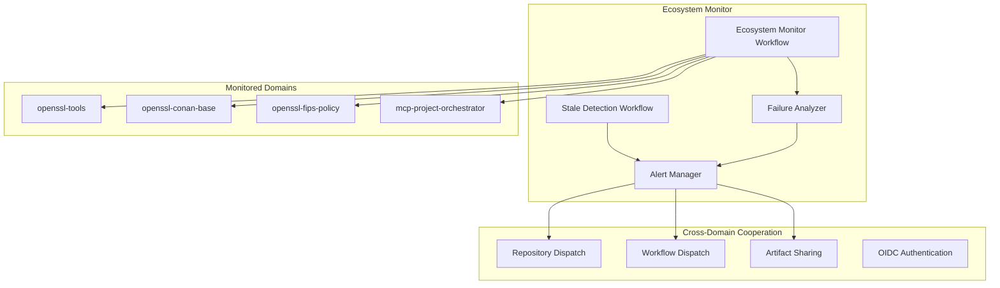

# Ecosystem Monitoring System

A comprehensive monitoring and alerting system for multi-domain GitHub repositories with cross-domain cooperation mechanisms.

## Overview

The Ecosystem Monitoring System provides:

- **Scheduled Aggregation**: Every 4 hours, monitors multiple domains for events and failures
- **Failure Analysis**: Advanced log analysis with domain-specific pattern detection
- **Stale Detection**: Automated detection and management of stale PRs and branches
- **Cross-Domain Cooperation**: Repository dispatch events and artifact sharing
- **Alerting**: Automated issue creation and notifications

## Architecture



## Components

### 1. Ecosystem Monitor Workflow

**File**: `.github/workflows/monitor-ecosystem.yml`

- **Schedule**: Every 4 hours (`0 */4 * * *`)
- **Manual Trigger**: `workflow_dispatch` with configurable domains
- **Repository Dispatch**: Responds to `ecosystem-alert`, `domain-failure`, `workflow-complete`

**Features**:
- Monitors multiple domains simultaneously
- Generates comprehensive analysis reports
- Creates GitHub Pages content
- Triggers cross-domain cooperation

### 2. Ecosystem Monitor Script

**File**: `scripts/ecosystem_monitor.py`

**Capabilities**:
- Fetches events from all configured domains
- Analyzes domain health and activity
- Detects failure patterns
- Generates JSON and Markdown reports
- Supports cross-domain cooperation

**Usage**:
```bash
python scripts/ecosystem_monitor.py \
  --domains "openssl-tools,openssl-conan-base,openssl-fips-policy,mcp-project-orchestrator" \
  --output-dir reports \
  --github-token "$GITHUB_TOKEN"
```

### 3. Enhanced Fixer Script

**File**: `scripts/fixer.py`

**Features**:
- Analyzes domain-specific logs (Conan, FIPS, workflow errors)
- Suggests reusable workflow improvements
- Generates GitHub Actions workflow fixes
- Supports cross-domain cooperation

**Pattern Detection**:
- **Conan Errors**: Package dependencies, configuration issues
- **FIPS Failures**: Security compliance, cryptographic modules
- **Workflow Errors**: CI/CD pipeline issues, permissions
- **Build Errors**: Compilation, dependency issues
- **Test Failures**: Unit tests, integration tests
- **Deployment Errors**: Container, Kubernetes issues

**Usage**:
```bash
python scripts/fixer.py \
  --log-files "build.log" "test.log" "deploy.log" \
  --cooperation \
  --target-repos "sparesparrow/github-events"
```

### 4. Stale Detection System

**File**: `.github/workflows/stale-detection.yml`

**Features**:
- Detects stale pull requests and branches
- Configurable thresholds (default: 30 days stale, 7 days to close)
- Automated labeling and cleanup
- Cross-repository monitoring

**File**: `scripts/stale_detector.py`

**Capabilities**:
- Identifies stale PRs and branches
- Adds stale labels
- Closes old PRs and deletes old branches
- Generates comprehensive analysis reports

### 5. Alert Manager

**File**: `scripts/alert_manager.py`

**Alert Types**:
- **Stale Alerts**: For stale PRs and branches
- **Critical Alerts**: For system-critical issues
- **Ecosystem Alerts**: For cross-domain issues
- **Maintenance Alerts**: For scheduled maintenance

**Features**:
- Automated issue creation
- Cross-domain notifications
- Configurable alert levels
- Rich issue formatting

## Cross-Domain Cooperation Mechanisms

### 1. Repository Dispatch Events

**Trigger**: `repository_dispatch` with event types:
- `ecosystem-alert`: Cross-domain ecosystem issues
- `domain-failure`: Domain-specific failures
- `workflow-complete`: Workflow completion notifications
- `fixer-analysis`: Fix suggestions from other domains

**Example**:
```yaml
on:
  repository_dispatch:
    types: [ecosystem-alert, domain-failure, workflow-complete]
```

### 2. Workflow Dispatch

**Manual Trigger**: `workflow_dispatch` for orchestration
- Fan-out to multiple domains
- Parameterized execution
- Cross-domain coordination

### 3. Artifact Sharing

**Cloudsmith Integration**:
- All domains publish artifacts with tags
- `fips: true, platform: linux`
- Pulled by other domains via OIDC
- Version-controlled artifact sharing

### 4. OIDC Setup

**Organization-wide Configuration**:
- Configure in GitHub settings
- Secretless access across repositories
- Secure cross-domain authentication

## Configuration

### Environment Variables

```bash
# Required
GITHUB_TOKEN=ghp_your_token_here

# Optional
DOMAINS=openssl-tools,openssl-conan-base,openssl-fips-policy,mcp-project-orchestrator
DAYS_UNTIL_STALE=30
DAYS_UNTIL_CLOSE=7
OUTPUT_DIR=reports
LOG_DIR=logs
```

### Workflow Parameters

**Ecosystem Monitor**:
- `domains`: Comma-separated list of domains
- `force_run`: Force run even if recent data exists

**Stale Detection**:
- `dry_run`: Dry run mode (no actual changes)
- `days_until_stale`: Days until PR/branch is stale
- `days_until_close`: Days until stale items are closed

## Monitored Events

### Event Types

The system monitors **23 different GitHub event types**:

**Core Development**:
- `WatchEvent`: Repository stars/watching
- `PullRequestEvent`: PR operations
- `IssuesEvent`: Issue management
- `PushEvent`: Code pushes
- `ForkEvent`: Repository forks
- `CreateEvent`: Branch/tag creation
- `DeleteEvent`: Branch/tag deletion
- `ReleaseEvent`: Releases

**Collaboration**:
- `CommitCommentEvent`: Commit comments
- `IssueCommentEvent`: Issue comments
- `PullRequestReviewEvent`: PR reviews
- `PullRequestReviewCommentEvent`: PR review comments

**Repository Management**:
- `PublicEvent`: Repository made public
- `MemberEvent`: Collaborator changes
- `TeamAddEvent`: Team additions

**Security & Maintenance**:
- `GollumEvent`: Wiki changes
- `DeploymentEvent`: Deployments
- `DeploymentStatusEvent`: Deployment status
- `StatusEvent`: Commit status
- `CheckRunEvent`: Check runs
- `CheckSuiteEvent`: Check suites

**GitHub-Specific**:
- `SponsorshipEvent`: Sponsorship changes
- `MarketplacePurchaseEvent`: Marketplace purchases

### Alert Thresholds

**Health Score Thresholds**:
- **Healthy**: 80-100 points
- **Warning**: 60-79 points
- **Critical**: 0-59 points

**Activity Thresholds**:
- **Recent Activity**: Events in last 4 hours
- **Stale Threshold**: 30 days without activity
- **Cleanup Threshold**: 7 days after stale detection

**Issue Severity**:
- **Critical**: FIPS failures, security issues
- **High**: Build failures, Conan errors
- **Medium**: Workflow errors, test failures
- **Low**: General maintenance issues

## Reports and Artifacts

### Generated Reports

**Ecosystem Analysis** (`ecosystem_analysis.json`):
```json
{
  "timestamp": "2024-01-15T10:30:00Z",
  "domains": {
    "openssl-tools": {
      "health_score": 85,
      "total_events": 150,
      "recent_activity": 12,
      "issues_detected": []
    }
  },
  "summary": {
    "total_domains": 4,
    "healthy_domains": 3,
    "unhealthy_domains": 1,
    "total_events": 600,
    "total_issues": 5,
    "critical_issues": 1
  },
  "failures": [...],
  "recommendations": [...]
}
```

**Stale Analysis** (`stale_analysis.json`):
```json
{
  "timestamp": "2024-01-15T10:30:00Z",
  "repository": "sparesparrow/github-events",
  "summary": {
    "total_stale_prs": 3,
    "total_stale_branches": 8,
    "oldest_pr_days": 45,
    "oldest_branch_days": 90
  },
  "stale_prs": [...],
  "stale_branches": [...],
  "recommendations": [...]
}
```

**Failure Analysis** (`failure_analysis.json`):
```json
{
  "pattern": "conan_error",
  "severity": "high",
  "category": "dependency",
  "suggestions": [
    "Check Conan package versions and compatibility",
    "Update Conan configuration files"
  ]
}
```

### GitHub Pages Integration

Reports are automatically published to GitHub Pages:
- `pages_content/ecosystem_analysis.json`
- `pages_content/ecosystem_summary.md`
- Interactive dashboards and visualizations

## Usage Examples

### Manual Ecosystem Monitoring

```bash
# Run ecosystem monitoring manually
gh workflow run monitor-ecosystem.yml \
  -f domains="openssl-tools,openssl-conan-base" \
  -f force_run=true

# Check stale items
gh workflow run stale-detection.yml \
  -f dry_run=true \
  -f days_until_stale=14
```

### Cross-Domain Cooperation

```bash
# Trigger repository dispatch event
curl -X POST \
  -H "Authorization: token $GITHUB_TOKEN" \
  -H "Accept: application/vnd.github.v3+json" \
  https://api.github.com/repos/sparesparrow/github-events/dispatches \
  -d '{
    "event_type": "ecosystem-alert",
    "client_payload": {
      "alert_level": "warning",
      "domains": ["openssl-tools"],
      "issues": ["build_failure"]
    }
  }'
```

### Log Analysis and Fixes

```bash
# Analyze logs and generate fixes
python scripts/fixer.py \
  --log-files "logs/build.log" "logs/test.log" \
  --cooperation \
  --target-repos "sparesparrow/github-events" "sparesparrow/openssl-tools"

# Generate workflow fixes
python scripts/fixer.py \
  --log-files "conan_error.log" \
  --output "conan_fixes.json"
```

## Troubleshooting

### Common Issues

**1. No Events Detected**:
- Check GitHub token permissions
- Verify domain names are correct
- Check API rate limits

**2. Stale Detection Not Working**:
- Verify repository permissions
- Check branch protection rules
- Review stale thresholds

**3. Cross-Domain Cooperation Failing**:
- Verify OIDC configuration
- Check repository dispatch permissions
- Review target repository access

### Debug Mode

Enable debug logging:
```bash
export LOG_LEVEL=DEBUG
python scripts/ecosystem_monitor.py --domains "test-domain"
```

### Dry Run Mode

Test without making changes:
```bash
python scripts/stale_detector.py --dry-run --token "$GITHUB_TOKEN"
```

## Security Considerations

### Token Management
- Use fine-grained personal access tokens
- Rotate tokens regularly
- Limit token scope to required permissions

### OIDC Configuration
- Configure organization-wide OIDC
- Use least-privilege access
- Monitor OIDC usage

### Repository Access
- Limit cross-repository access
- Use repository dispatch for communication
- Audit access logs regularly

## Monitoring and Metrics

### Key Metrics
- **Ecosystem Health Score**: Overall system health
- **Domain Activity**: Events per domain
- **Failure Rate**: Failed operations percentage
- **Stale Items**: Count of stale PRs/branches
- **Alert Response Time**: Time to create alerts

### Dashboards
- GitHub Pages: Static reports and visualizations
- GitHub Issues: Automated issue tracking
- Workflow Artifacts: Detailed analysis reports

## Future Enhancements

### Planned Features
- **Machine Learning**: Predictive failure analysis
- **Advanced Analytics**: Trend analysis and forecasting
- **Integration**: Slack, Teams, email notifications
- **Custom Rules**: User-defined monitoring rules
- **Real-time Monitoring**: WebSocket-based live updates

### Extensibility
- Plugin system for custom analyzers
- Custom alert channels
- Domain-specific configurations
- Advanced workflow templates

## Support

For issues and questions:
1. Check the troubleshooting section
2. Review GitHub Issues for similar problems
3. Create a new issue with detailed information
4. Include relevant logs and configuration

## License

This ecosystem monitoring system is part of the GitHub Events Monitor project and follows the same licensing terms.